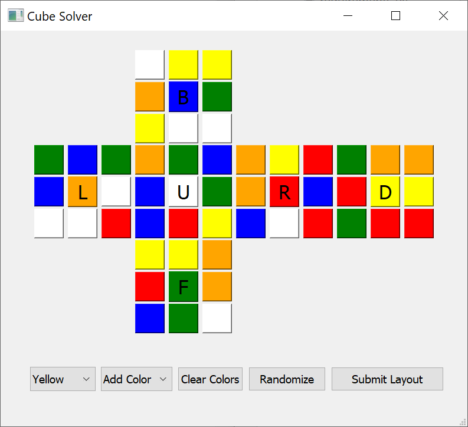

# Cube Solver
Virtual Rubik's Cube solver developed in 24 hours during SBUHacks 2019! 

**Averages 90 moves to solve!**

## How to use

  

1. Run app.py to open the GUI. You can either click the randomize button or enter the colors manually.  
2. From the dropdown menu, select the color of the sticker.  
3. Click on the boxes to color the sticker.  
4. Repeat for all six colors.   
5. Click the submit button to generate the solution.  
6. Wait for the program to generate the solution.    
7. Now watch the 3D solver solve the cube!

  <video src="https://github.com/mikee478/cube-solver/assets/28791222/3bf20cf7-7054-47a0-adc3-6487b0787115"/>

  
## Developers
- **Jihu Mun** - [Github](https://github.com/altronis)
- **Samuel Van der Sloot** - [Github](https://github.com/samjpv)
- **Michael Wolf-Sonkin** - [Github](https://www.github.com/mikee478)
